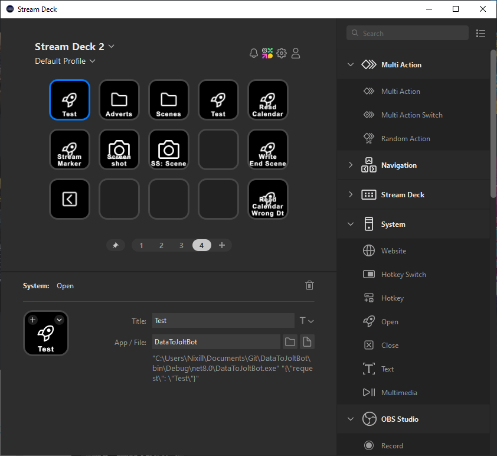

This is a *VERY* rudimentary named pipe client designed to work with the server built into [Jolt](https://github.com/Nixill/JoltBot). I made it because I didn't have time to make a full StreamDeck plugin, and it does what I need it to do.

It turns the command-line args into a JSON array and sends it to the bot.

Usage: Create a "Run App" action and point it at the exe with valid parameters in the command line. For example:

Valid requests are documented in the [JoltBot repo]()

# How it used to work
Because Elgato fucked up the Run App action, this no longer works and I had to completely change it.

It parses command-line input as a JSON object and sends it to the bot.

Usage: Create a "Run App" action and point it at the exe with a JSON object in the command line. For example:

Make sure to escape the quotes in the JSON object! For example, `"C:\Path\to\DataToJoltBot.exe" "{\"request\": \"Test\"}"`

Parameters just go in the root-level object. For example, `"C:\Path\to\DataToJoltBot.exe" "{\"request\": \"Scenes.Switch\", \"scene\": \"sc_Title Screen\", \"show\": [\"grp_BeRightBack\"]}"`.

Valid requests are documented in the [JoltBot repo](https://github.com/Nixill/JoltBot/blob/main/TwitchStreamBot/src/pipes/README.md).